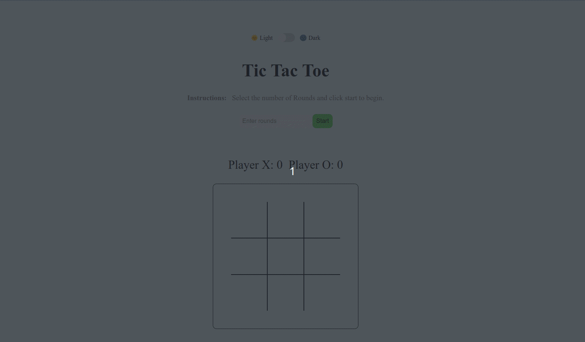

# Tic Tac Toe DOM Game

## Description

Tic Tac Toe is a classic two-player game where players take turns marking spaces in a 3x3 grid. The player who succeeds in placing three of their marks in a horizontal, vertical, or diagonal row wins the game. This interactive version of the game is built using HTML, CSS, and JavaScript, and offers both light and dark modes for enhanced user experience.

The Tic Tac Toe game offers a perfect blend of simplicity and interactivity. Whether you're looking to pass some time or challenge a friend, this game ensures fun and engagement with its intuitive interface and dynamic features.

## Features

1. **Dynamic Game Board:** A 3x3 grid where players can make their moves.
2. **Score Tracking:** The game keeps track of scores for both Player X and Player O.
3. **Round Selection:** Players can decide how many rounds they want to play.
4. **Winning Logic:** The game detects wins and draws, displaying appropriate messages.
5. **Restart Functionality:** Players can restart the game at any point.
6. **Dark Mode:** An option to toggle between light and dark themes for a customized visual experience.

## JavaScript Techniques

1. **DOM Manipulation:** The script extensively interacts with the DOM to update the game board, display messages, and track scores.
2. **Event Handling:** The code listens for clicks on the game board cells, the restart button, the start button, and the dark mode toggle.
3. **Game Logic:** Functions are in place to check for winning conditions, draw conditions, and to manage player turns.
4. **Dynamic Styling:** The game updates styles dynamically based on game states (e.g., win, draw) and user actions (e.g., dark mode toggle).

## The JavaScript functionality for the tic-tac-toe game is as follows:

1. **DOM Selection:** The script begins by selecting various elements from the DOM, such as the game cells, board, score displays, rounds input, and more.
2. **Game Logic:**
   - The game checks for a win or draw after every move.
   - `checkWin()`: Determines if the current player has won.
   - `isDraw()`: Checks if the game is a draw (i.e., all cells are filled without a win).
   - `draw()`: Handles the scenario when the game is drawn.
   - The game maintains a count of the rounds played and the scores of both players (Player X and Player O).
3. **Event Listeners:** The script has several event listeners:
   - Starting the game based on the number of rounds inputted.
   - Restarting the game.
   - Making a move in the game.
   - Toggling dark mode.
4. **Dark Mode Functionality:** Allows the user to switch between light and dark themes for the game interface.
5. **Game Initialization:** The `startGame()` function resets the game board, updates scores, and sets the turn for the next player.
# tic-tac-toe
